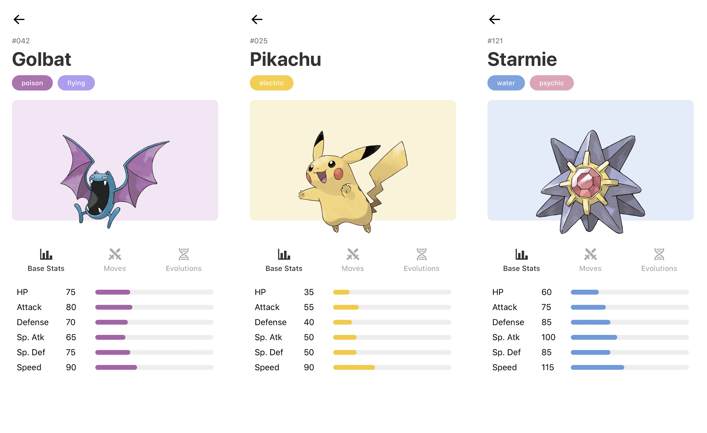

# Pokédex App
A React Native mobile app that provides information about the various species of Pokémons.

### Screenshots

### Dependencies
* [PokéAPI](https://pokeapi.co/)
* [Pokédex | Pokemon.com](https://www.pokemon.com/us/pokedex/)